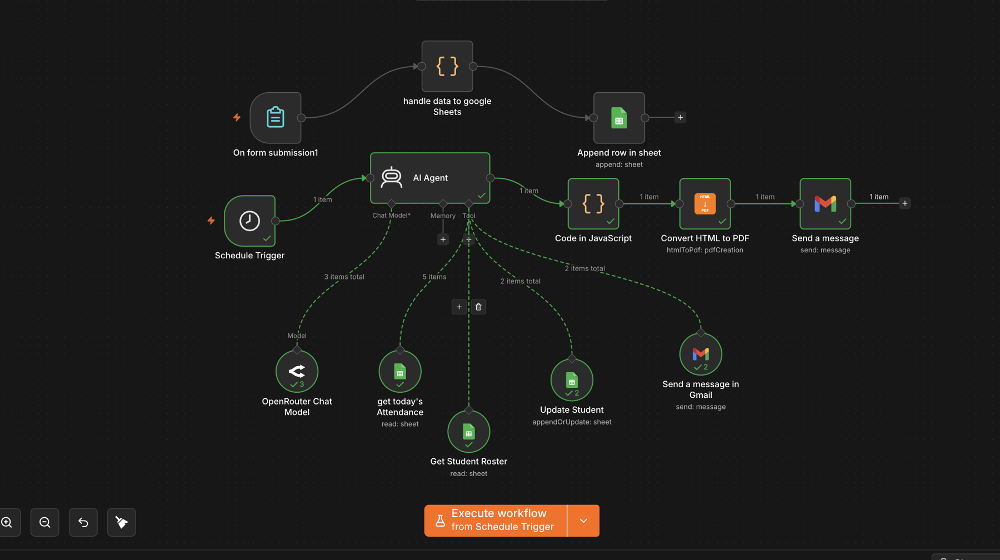

# iti_Student Daily Attendance (n8n)

An n8n automation that runs a training institute's daily attendance end-to-end: students check in via a form, and every morning an AI agent closes the attendance window, applies the absence policy, updates records, emails warnings/dismissals, and sends a PDF daily report.



## What it does

**Student side (real-time):**
- A student fills a short **web form** (Name, Student ID, Attendance Mode: Online/Offline) before 4 PM (or whatever the cutoff is).
- The submission's timestamp (Egypt time) is checked against the attendance window (03:00–03:40 UTC in this config) to mark the student **Present** or logged, and the row is appended to a Google Sheet.

**Daily processing (automatic, scheduled):**
- Every day at **9:10 AM**, a Schedule Trigger kicks off an **AI Agent** that:
  1. Reads today's attendance submissions from the Attendance sheet.
  2. Reads the full active **Student Roster** sheet.
  3. Cross-checks each active student's Student ID + Status to decide **Present vs. Absent** (existence of a submission alone isn't enough — status must be exactly "Present").
  4. Uses Attendance Mode to tally **Online / Offline** counts.
  5. For every absent student: increments their absence count, and applies the policy:
     - **1–2 absences** → Warning email, student stays Active.
     - **3+ absences** → Dismissal email, student's status set to Inactive.
  6. Updates the roster sheet and sends the appropriate email per affected student.
  7. Returns a strict JSON summary (never prose) with totals: present, absent, online, offline, warnings sent, dismissals sent, and the list of affected students.
- That JSON is turned into a styled **HTML report**, converted to a **PDF**, and emailed to staff.

## How it works (architecture)

```
┌─────────────────────────┐
│  On form submission1    │  (student fills attendance form)
└───────────┬──────────────┘
            ▼
  handle data to google Sheets   (Code node: computes Present/Absent + Egypt timestamp)
            ▼
     Append row in sheet         (Google Sheets: logs the submission)


┌─────────────────────────┐
│    Schedule Trigger      │  (fires daily at 9:10 AM)
└───────────┬──────────────┘
            ▼
        AI Agent   ◄── OpenRouter Chat Model (Gemini)
       │   │   │
       │   │   └── Tools:
       │   │        ├── get today's Attendance   (Google Sheets: read)
       │   │        ├── Get Student Roster       (Google Sheets: read)
       │   │        ├── Update Student           (Google Sheets: appendOrUpdate)
       │   │        └── Send a message in Gmail  (warning/dismissal emails)
       │   ▼
       │  (structured JSON report)
       ▼
  Code in JavaScript   (builds HTML + CSS report from the JSON)
            ▼
    Convert HTML to PDF
            ▼
      Send a message   (emails the PDF daily report to staff)
```

**Nodes:**

| Node | Type | Role |
|---|---|---|
| `On form submission1` | Form Trigger | Student-facing attendance form (Name, Student ID, Online/Offline) |
| `handle data to google Sheets` | Code | Computes Egypt-local date/time and Present/Absent status from the attendance window |
| `Append row in sheet` | Google Sheets | Logs each submission to the Daily Attendance sheet |
| `Schedule Trigger` | Schedule | Fires once daily at 9:10 AM |
| `AI Agent` | LangChain AI Agent | The compliance officer — cross-checks attendance vs. roster, applies the absence policy, drives every tool call |
| `OpenRouter Chat Model` | LLM | Powers the agent (Gemini via OpenRouter) |
| `get today's Attendance` | Google Sheets tool | Reads today's submissions |
| `Get Student Roster` | Google Sheets tool | Reads the full active student roster |
| `Update Student` | Google Sheets tool | Updates a student's absence count / status |
| `Send a message in Gmail` | Gmail tool | Sends warning/dismissal emails to individual students |
| `Code in JavaScript` | Code | Converts the agent's JSON summary into an HTML report (+ CSS) |
| `Convert HTML to PDF` | HTML-to-PDF | Renders the HTML report as a PDF |
| `Send a message` | Gmail | Emails the final PDF report to staff |

## The system prompt — how the agent enforces policy

The AI Agent is instructed to act strictly as a rules engine, not a free-form assistant:

- **No invented data:** must retrieve everything (attendance, roster, absence counts) via tools — never guesses student IDs, names, or emails.
- **Present requires two conditions:** the Student_ID must exist in today's submissions **and** its Status must be exactly `"Present"` — existence alone doesn't count.
- **Absence policy:** absence count +1 per absent student → 1–2 total absences = Warning (stay Active), 3+ = Dismissal (set Inactive).
- **No duplicate processing:** each absent student is updated and emailed exactly once; already-Inactive students are left alone.
- **Strict output contract:** the agent must return only valid JSON matching a fixed schema (no markdown, no explanations, no extra text) — the daily report is generated separately, downstream, from that JSON.
- **Never emails the summary itself** — that's explicitly left to the PDF pipeline after the agent finishes.

## Setup

1. **Import** `iti_Student_Daily_Attendance.json` into your n8n instance.
2. **Reconnect credentials** — this export has all credential references stripped. You'll need your own for:
   - Google Sheets OAuth2 (used by `Append row in sheet`, `get today's Attendance`, `Get Student Roster`, `Update Student`)
   - Gmail OAuth2 (used by `Send a message in Gmail` and `Send a message`)
   - HTML-to-PDF API (used by `Convert HTML to PDF`)
   - OpenRouter API (used by `OpenRouter Chat Model`)
3. **Point at your own Google Sheets:**
   - A "Daily Attendance" sheet with columns: `Date, Student_ID, Name, Time, Attendence mode, Statue`
   - A "Full Student Roster" sheet with each active student's ID, name, email, absence count, and status
   - Replace the placeholder sheet IDs in `Append row in sheet`, `get today's Attendance`, and `Get Student Roster`.
4. **Set the staff report recipient** — replace the placeholder email in the `Send a message` node with your own staff address.
5. **Adjust the attendance window / schedule time** if 9:10 AM (Africa/Cairo) doesn't match your institute's schedule — edit the `handle data to google Sheets` code node and the `Schedule Trigger`.
6. **Activate** the workflow, publish the form link to students, and you're done.

## Notes

- All times are computed in `Africa/Cairo` timezone — change this in the code nodes if you're elsewhere.
- The LLM is Gemini via OpenRouter (`google/gemini-3-flash-preview`) — swap the model string for another provider if preferred.
- The report design (cards, colors, table) lives entirely in the `Code in JavaScript` node's HTML/CSS — easy to restyle without touching the AI logic.
